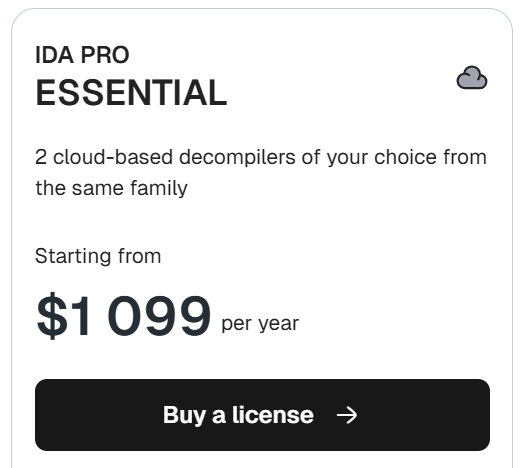

---
tags:
  - アプリケーション
---

# IDA / Hex-Rays Decompiler

IDA(Interactive DisAssembler)はHex-Raysが開発する商用の逆アセンブラ/解析環境です. 
バイナリを解析プロジェクトとして管理し, 逆アセンブル, 型推論, 関数境界の推定などを支援します. 
付属するIDA Decompilerは高性能なデコンパイラとして知られており, リバースエンジニアリングにおける事実上のデファクトスタンダードになっています. 
また, 価格が高いことでも知られており, IDA Proは2025年12月時点で年間ライセンスが1100ドル程です. 

余談として30年以上という非常に長い歴史を持つソフトウェアとしても知られています. なんとLinux以前から存在していたようです[^1]. 

- 公式サイト: [hex-rays.com/ida-pro](https://hex-rays.com/ida-pro/)

[^1]:参考: https://hex-rays.com/blog/ida-celebrating-30-years-of-binary-analysis-innovation