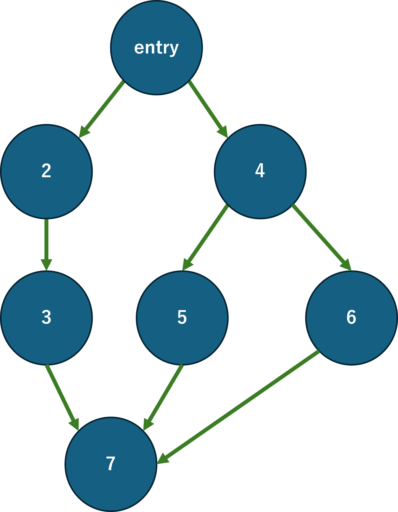

---
tags:
  - 用語
  - グラフ理論
  - 書きかけの項目
---

# Dominator(グラフ上の支配関係)

**Dominator**はグラフ理論における概念の一つであり, 有向グラフにおいて, あるノードに到達するために必要なノードを表します. 
デコンパイル, プログラムの静的解析においては[CFG](./CFG.md)における基本ブロックのdominatorを計算し, 最適化やパターンマッチングに用います. 

Dominatorは厳密には以下のように定義されます. 

単一のentry node $e$ を持つ有向グラフ$G(V, E)$を仮定する. あるノード$d \in V$がノード$n \in V$を**支配する(Dominate)**とは, $e$から$n$への全ての経路(path)に$d$が含まれていることを指す. また$n$を支配するノードの集合を**Dominator**と呼ぶ. 

この定義はつまり, $n$に到達するには$d$を必ず通らなければならないことを意味します. これはつまり, $n$は$d$の持つ到達可能性に関する性質を殆ど引き継ぐ事を意味するためプログラムの解析において重要な意味を持ちます. 
また, 例外的に全てのノードは自分自身を支配し, entry nodeは全てのノードを支配します.

また, 支配関係は到達可能なノードの集合の上で半順序関係を構成します. グラフには分岐があるため二つのノードのどちらもが相手を支配しない状況が生まれるので全順序にはなりません. 

## Strict Dominator(厳密支配)

dominatorでは全てのノードは自身を支配することになっていましたが, あるノード$n$における**Strict Dominator**は$n$のdominatorから$n$自身を除いたものを指します. 

## Immediate Dominator(即時支配)

あるノード$n$の最も近接なStrict Dominatorを**Immediate Dominator**と呼びます. 厳密には以下のように定義されます. 

ノード$d$がノード$n$を即時支配する(Immediate Dominate)とは, $d$が$n$を厳密に支配し, かつ, $n$を厳密に支配する他のどのノード$d'$も$d$を支配することを指す. 

## Dominator Tree(支配木)

即時支配関係は任意の二つのノードの間にも一意に定まります. そこであるグラフ$G(V, E)$における即時支配関係をエッジとして有向グラフを新たに生成するとグラフは木(Tree)になります. このような即時支配関係から生成したグラフをDominator Treeと呼びます. 

## 例

例えば以上のグラフにおける支配関係は以下のような表で表されます. 

| 対象ノード | 支配ノードの集合 (Dominators) |
|-----------|-------------------------------|
| entry     | {entry}                      |
| 2         | {entry, 2}                   |
| 3         | {entry, 2, 3}                |
| 4         | {entry, 4}                   |
| 5         | {entry, 4, 5}                |
| 6         | {entry, 4, 6}                |
| 7         | {entry, 7}                   |

また, このグラフを元に支配木を生成すると以下のようになります. 

## Dominatorを計算するアルゴリズム

TODO

## 参考文献

1. Mozilla Developer Network. "Dominators - Firefox Source Docs". *Firefox Source Docs*. https://firefox-source-docs.mozilla.org/devtools-user/memory/dominators/index.html 

2. Wikipedia contributors. "Dominator (graph theory)". *Wikipedia, The Free Encyclopedia*. https://en.wikipedia.org/wiki/Dominator_%28graph_theory%29